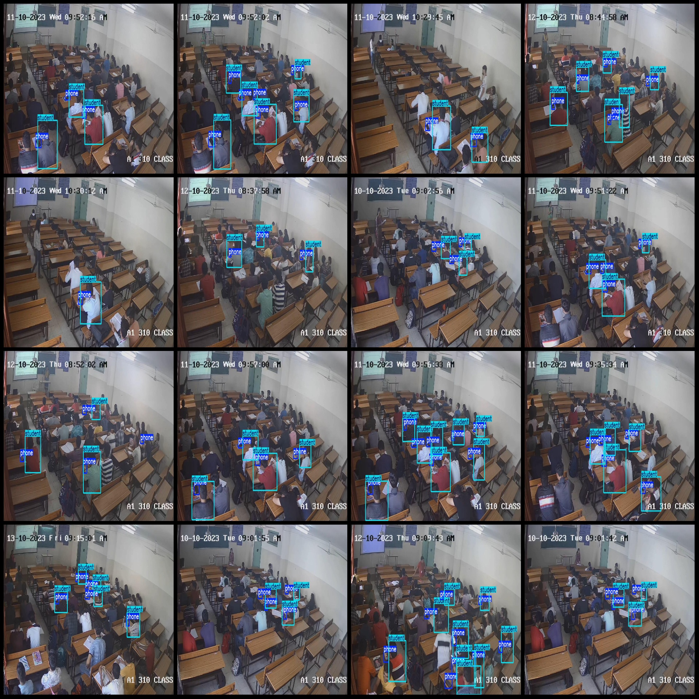
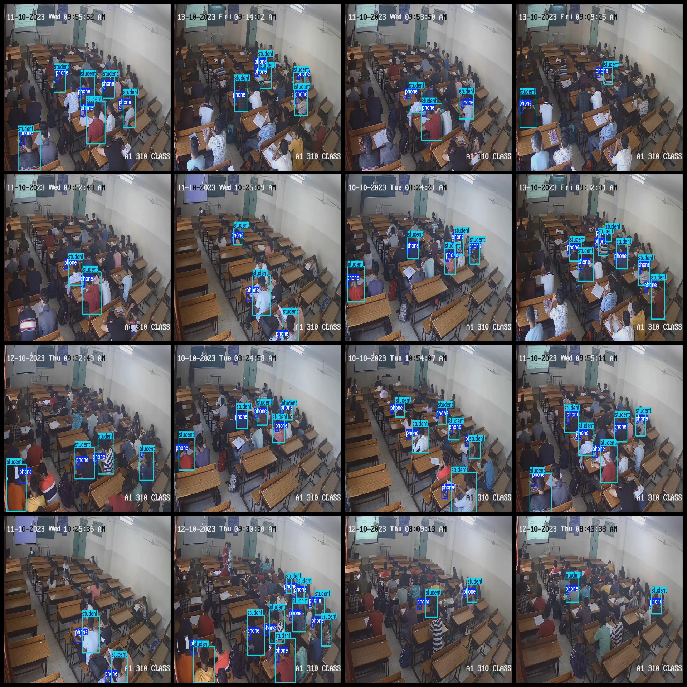

# Intelligent Classroom Interruption Detection Dataset (VOC+YOLO) - 253 Images, 2 Categories

The dataset format is as follows: Pascal VOC format + YOLO format (without segmentation paths, just containing the jpg image and corresponding VOC format xml file and yolo format txt file).
number of images: 253  
annotation count: 253  
annotation count: 253  
annotationnumber of classes: 2  
Annotation class names (Note that the order of Yolo format class names does not correspond to this, but is based on the labels file and classes.txt): ["phone", "student"]
boxes per class:   
The count of phone boxes is 1135.
The student who is playing with their phone counts as 1103 in the box count.
total boxes: 2238  
image resolution: 1280x720  
Use annotation tool: labelImg
Annotation rules: draw a rectangle around the class
Important notes: Dataset needs to be split into training, validation, and test sets.
Special statement: This dataset does not guarantee the accuracy of the trained model or weight file.
Image preview:
## Images

Here is a pay link on Stripe ( https://buy.stripe.com/3cs8yP7sY87d0vu9AB ). Please contact me lonlonago@foxmail.com after funding $89, and I will send you a complete data files , thank you!

